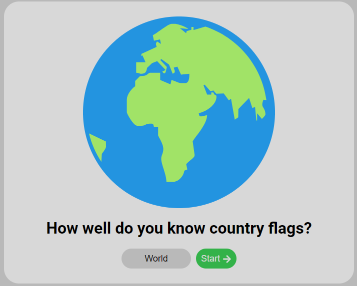

# Flag game

## Introduction
This project is a very simple game about country flags, the player gets shown a flag and has to type in the corresponding country name.

I started this project because I wanted to learn all the countries flags and get familiar with React.

This project has been my first experience with React and has helped me get a rough understanding of the React library. (I also know all the country flags now!)

## About the game
The game is heavily reliant on the [react-country-flag](https://www.npmjs.com/package/react-country-flag) component, which is used to render the flags on the page. It also uses [react-icons](https://www.npmjs.com/package/react-icons) to render some icons.

### Gamemodes

The player can switch between gamemodes by pressing the currently selected gamemode.
There are several different gamemodes based on the different continents. The gamemodes are:
- World
- Africa
- Asia
- Europe
- North America
- Oceania
- South America

### Highscores

The game keeps track of a players highscores in the browsers local storage. The best 10 scores are saved and rendered for the player. The scores are ranked on score. If two scores have the same score, the time is considered.

## Running locally
1. Clone the repository
2. Navigate to the repository folder in your terminal
3. Run: `npm install`
4. Run: `npm run dev`
5. Visit the project on (most likely) http://localhost:5173/